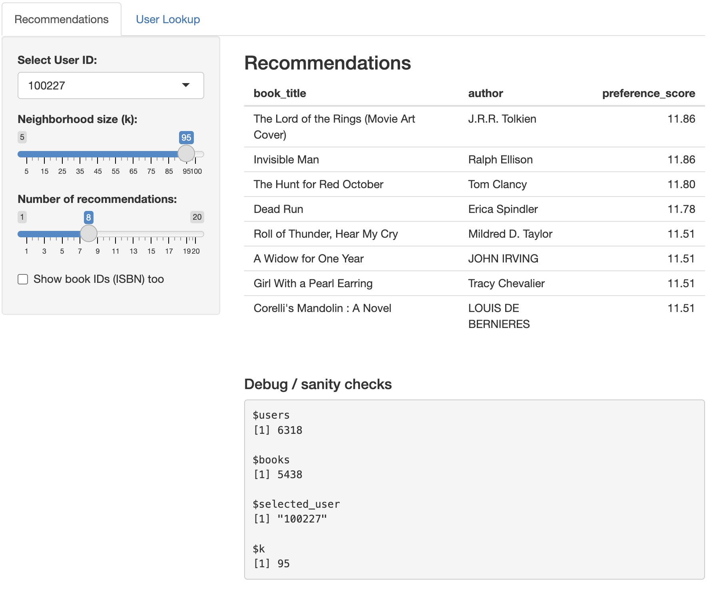
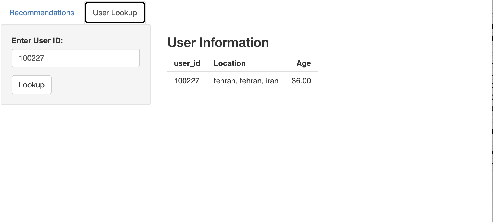

# **Exploring k-Nearest Neighbors in Recommendation Systems**

## **Introduction**

Today’s digital world is overflowing with information, making it nearly impossible for individuals to manually sift through the massive number of available options. As a result, recommender systems have become essential components of platforms such as Netflix, Amazon, Spotify, and TikTok. Their primary goal is to filter vast collections of items such as movies, products, songs, or videos, and present users with options they are most likely to enjoy. These systems work by analyzing users’ preferences, past behaviors, and item characteristics through interaction data such as impressions, clicks, ratings, likes, and purchases [@ghosh2024].

This paper focuses on the k-nearest neighbors (kNN) algorithm within the context of recommendation systems. Although kNN is one of the more straightforward algorithms in machine learning, it plays a foundational role in collaborative filtering methods. kNN identifies users or items that are most similar in behavior or preferences and bases predictions on these neighbors. Its simplicity and intuitive mechanics make it especially suitable for educational purposes and small scale recommendation tasks.

Before exploring the details of kNN, this paper outlines the broader landscape of recommendation systems to provide a foundation for understanding how kNN fits into the larger family of recommendation systems. The discussion then introduces and contrasts a different recommendation approach, Singular Value Decomposition (SVD) to highlight the strengths and weaknesses of kNN in practice.

Finally, the second half of the paper applies kNN to a real dataset to build and evaluate a simple interactive recommender system so as demonstrate how the method works in practice and gauge its performance.

## **Overview of Recommender Systems**

Recommendation systems work by estimating how much a user is likely to enjoy an item they have not yet interacted with. They do this by analyzing **user behavior**, such as past ratings or interactions and **item features**, such as genre, creator, or textual descriptions [@ghosh2024]. The goal is to estimate a preference score, ${r}_{u,i}$ which measures how likely user u is to enjoy item i. Preference score values, as you'll see later in the paper, vary based on the rating scales. Recommendations are then generated by selecting the items with the highest scores[@aggarwal2016]. 

To understand how k-nearest neighbors (kNN) fits into this broader landscape, we will discuss two major families of recommendation approaches: content-based approach and collaborative filtering. There are hybrid recommenders too discussed in (@apxml2025) paper which combine the two approaches.

### **Content-Based Filtering**

Content-based recommender systems generate suggestions by comparing the attributes of items a user previously liked to those of new items [@ghosh2024]. These attributes might include genres, keywords, textual descriptions, or metadata. The item descriptions, which are labeled with ratings, are used as training data to create a user-specific classification or regression modeling problem. As (@aggarwal2016,p. 14) explains, for each user the training documents correspond to the descriptions of the items she has bought or rated. For example, if a shopper frequently purchases skincare products, the system recommends related cosmetic items.

The underlying assumption is that user preferences are largely consistent, and similar items will yield similar satisfaction [@ghosh2024]. These models rely heavily on item features, making them effective in domains where rich metadata is available.

![Content-based vs. Collaborative Filtering [source: @sharma2020]](images/colabvcontent.png)

### **Collaborative Filtering**

Collaborative filtering takes a different approach by focusing on patterns of behavior across users rather than item attributes. The key assumption is that users who behaved similarly in the past will behave similarly in the future [@apxml2025]. The main challenge in designing collaborative filtering methods is that the underlying ratings matrices are sparse i.e. most ratings are unspecified. However, in practice these unspecified ratings can be imputed because the observed ratings are often highly correlated across various users and items [@ricci2022]. There are two main subtypes:

#### **Memory-Based Methods**

Memory-based methods make predictions directly from observed ratings by identifying similarities among users or items. kNN is the most common example and can be further categorized into user-based kNN and item-based kNN as we'll see in the next sections. The advantages of memory-based techniques are that they are simple to implement and the resulting recommendations are often easy to explain [@aggarwal2016].

#### **Model-Based Methods**

Model-based approaches use machine learning techniques to uncover latent patterns in the rating matrix. Examples include matrix factorization, SVD, and Neural networks [@apxml2025]. They tend to outperform memory-based methods on large, sparse datasets but are less transparent to users and developers. Notably, many hybrid recommenders combine kNN with model-based techniques, such as SVD, to balance simplicity and predictive power [@hssina2021].

## K-Nearest Neighbors in Recommendation Systems

This section provides a deeper exposition of how kNN works, beginning with motivation and intuition, then moving into supervised-learning kNN, and finally examining how the algorithm is adapted for recommendation systems. A worked toy example concludes the section to illustrate the computations concretely.

### **Motivation:** Why Neighbors Matter in Recommendations

The appeal of neighborhood‑based methods lies in their simplicity as people with similar tastes tend to enjoy similar things [@nikolakopoulos2021]. If two users have consistently rated the same movies in comparable ways, then the films one user has enjoyed but the other has not yet seen become strong candidates for recommendation. This intuition, that preferences cluster and can be shared across neighbors, forms the foundation of k‑Nearest Neighbors (kNN) in recommender systems. By exploiting these local patterns, kNN can generate useful predictions without the need for complex modeling [@nikolakopoulos2021].

### **How kNN Works in Supervised Learning**

Before adapting kNN to recommender systems, it helps to first understand how the algorithm works in its original setting. Unlike most algorithms we've seen in class that estimate parameters or fit equations, kNN is a “lazy learner” [@knn_lazy]. It stores the training data and defers computation until a query arrives. When a new example is presented, the algorithm measures its similarity to all stored examples, selects the *k* closest ones, and bases its prediction on their values.

In classification tasks, the new example is assigned to the majority class among its neighbors. In regression, the prediction is the average of their values. Weighted variants of kNN give greater influence to closer neighbors, which reduces the impact of outliers. The choice of *k* is critical to prevent over or under fitting of the model. Too small a neighborhood makes the algorithm sensitive to noise, while too large a neighborhood can dilute meaningful signals.

![A simple illustration of kNN[source: @medium_knn]](images/knnimage1.png){width="300px" height="300px"}

Because kNN does not assume any particular distribution of the data, it is considered non‑parametric. This flexibility makes it easy to apply, but it also introduces challenges in high‑dimensional spaces where distances lose contrast, a phenomenon known as the curse of dimensionality [@kramer2013, pg 19]. The curse of dimensionality means that as the number of features grows, data points become increasingly sparse and distance measures lose meaning, making algorithms like kNN less effective[@geeksforgeeks_curse].

### **How kNN Works in Recommender Systems**{#sec-rec}

In recommendation settings, the task is to predict missing ratings in a sparse user-item matrix of size (number of users) × (number of items). Each row represents a user, each column an item, and most cells are empty because users interact with only a small fraction of available items. Below is an example of such matrix:

| User / Item | A   | B   | C   | D   |
|-------------|-----|-----|-----|-----|
| U1          | 4   | 4   | ?   | 3   |
| U2          | 4   | 5   | 2   | ?   |
| U3          | ?   | 4   | 4   | 3   |
| U4          | 2   | ?   | 5   | ?   |

Since most cells are empty, kNN adapts by computing similarities only on overlapping ratings. (@kramer2013) notes that this reliance on shared ratings is both a strength because it uses actual behavioral similarity and a weakness because sparsity may cause the similarities to be unreliable. Two main variants are used:

-   **User‑based kNN:** The system identifies the *k* users most similar to the target user and infers preferences from their ratings [@nikolakopoulos2021]. For example, if User 1 and User 2 have rated many of the same items similarly, then User 2’s rating of a new item can help predict User 1’s interest.
-   **Item‑based kNN:** Instead of comparing users, the system finds items that consistently receive similar ratings across users [@nikolakopoulos2021]. If Item A and Item B are rated alike by many users, then a user who liked Item A is predicted to enjoy Item B as well. Item‑based kNN is often more stable because item relationships remain consistent even as new users enter or leave the system [@ricci2022]. For this reason, modern commercial recommenders tend to use item-based kNN over user-based.

Similarity metrics are central to these computations and are obtained in various ways. Euclidean distance, which we're already familiar with, provides the most straightforward measure of closeness between rating vectors. However, as explained in chapter 3 of (@apxml2025), it is sensitive to differences in rating scales and magnitudes. To address this, cosine similarity measures the angle between rating vectors and is thus resistant to scale differences. Another method, Pearson correlation, adjusts for user biases by centering ratings around individual means. Finally, Adjusted cosine similarity subtracts user averages before computing similarity to reduce the effect of rating habits [@aggarwal2016]. In this paper, we use **cosine similarity**, defined as: $$
\text{similarity} = \cos(\theta) = \frac{A \cdot B}{\|A\| \cdot \|B\|}
$$

where $A \cdot B$ is the dot product of the vectors and $\|A\|$, $\|B\|$ are their magnitudes.

The similarity scores typically range from -1 to 1, with -1 for vectors that are polar opposites, 0 where there is no correlation, and 1 for perfectly similar vectors. Once similarities are computed, preference scores are calculated using weighted averages. In user-based approach, a simple average of available ratings is often misleading because different users have different rating scales [@apxml2025]. One user might rate movies from 3 to 5 stars, while another uses the full 1 to 5 range. To account for this, we use the deviation from each user's average rating. For user‑based kNN, one formula for calcuating the predicted rating of user (u) for item (i) is defined as:

$$
P_{u,i} = \bar{r}_u + \frac{\sum_{v \in N} sim(u,v) \cdot (r_{v,i} - \bar{r}_v)}{\sum_{v \in N} |sim(u,v)|}
$$

Where;

-   $P_{u,i}$ is the predicted rating/preference score for the target user (u) on item (i).

-   $\bar{r}_u$ is user (u)’s average rating. We add it at the end so that the prediction is returned to the user’s original rating scale.

-   N is the neighborhood of users most similar to (u) who have rated item (i).

-   $\text{sim}(u,v)$ is the similarity score between the target user (u) and a neighbor (v).

-   $r_{v,i} - \bar{r}_v$ is neighbor (v)’s rating of item (i), centered by subtracting their own average rating. This expresses how much higher or lower than average the neighbor rated that item.

-   The denominator, $\sum_{v \in N} |\text{sim}(u,v)|$, normalizes the weighted sum so that the prediction isn’t inflated by the number or magnitude of similarity scores.

Formula and breakdowns were sourced from chapter 3 of (@apxml2025).

For item-based kNN, the logic mirrors the user-based approach but is slightly simpler. To predict user (u)’s rating for item (i), we look at the other items that user (u) has already rated. The prediction is formed by taking a weighted average of those ratings, where the weights come from the similarity between item (i) and each neighboring item.

The formula is:

$$
P_{u,i} = \frac{\sum_{j \in N} sim(i,j) \cdot r_{u,j}}{\sum_{j \in N} |sim(i,j)|}
$$

Where;

-   $P_{u,i}$ is the predicted rating/preference score for user (u) on item (i).

-   N is the set of items most similar to item (i) that user (u) has already rated.

-   $\text{sim}(i,j)$ is the similarity between the target item (i) and a neighbor item (j).

-   $r_{u,j}$ is the rating user (u) gave to item (j).

Formula and breakdowns were sourced from chapter 3 of (@apxml2025).

The item-based formulation is slightly simpler than the user-based version because we do not need to adjust for user averages. All ratings involved in the calculation come from the same user therefore their rating scale is already consistent across items.

A critical design choice in kNN is the size of the neighborhood, denoted by $k$. The number of neighbors directly influences the bias-variance trade‑off in predictions [@dsm_biasvariance]. With very small $k$, the recommender becomes highly sensitive to noise in individual ratings, which can reduce accuracy. With very large $k$, the recommender averages across many dissimilar users or items, diluting meaningful signals. In practice, the optimal $k$ is determined empirically by evaluating accuracy metrics such as RMSE, MAE, Precision, and Recall across different values of $k$ [@aggarwal2016]. Cross‑validation is commonly used to select $k$, ensuring that the chosen neighborhood size generalizes well to unseen data [@linkedin_knn].

### **Toy Example** 

We work through a toy example adapted from Aggawral's book to emphasize idea. Consider a simple dataset of three users and three movies:

| User | A   | B   | C   |
|------|-----|-----|-----|
| U1   | 5   | 4   | ?   |
| U2   | 4   | 4   | 2   |
| U3   | 1   | 1   | 1   |

**Entries:** Ratings on a 1–5 scale. The “?” is the missing rating we want to predict (U1’s rating for Movie C).

First, we compute the similarity between Movie C and movies that U1 has already rated (A and B) using cosine similarity.

-   **Movie A ratings vector:** \[5, 4, 1\] from U1, U2, U3\
-   **Movie B ratings vector:** \[4, 4, 1\] from U1, U2, U3\
-   **Movie C ratings vector:** \[?, 2, 1\] → U1’s rating is missing, so we only use U2 and U3: \[2, 1\]

Now,

To compute **sim(A, C)**, we compare Movie A’s ratings from U2 and U3 (\[4, 1\]) with Movie C’s ratings from U2 and U3 (\[2, 1\]).

$$
sim(A,C) = \frac{(4 \cdot 2) + (1 \cdot 1)}{\sqrt{4^2+1^2} \cdot \sqrt{2^2+1^2}} \approx 0.98
$$

To compute **sim(B, C)**, we compare Movie B’s ratings from U2 and U3 (\[4, 1\]) with Movie C’s ratings from U2 and U3 (\[2, 1\]).

$$
sim(B,C) = \frac{(4 \cdot 2) + (1 \cdot 1)}{\sqrt{4^2+1^2} \cdot \sqrt{2^2+1^2}} \approx 0.96
$$

These values (0.98 and 0.96) show that Movies A and B are both highly similar to Movie C therefore we use their ratings to calculate the predicted rating for Movie C.

Plugging in values into the Item-Based formula we get:

$$
P_{U1,C} = \frac{(0.98 \cdot 5) + (0.96 \cdot 4)}{0.98 + 0.96} = \frac{4.9 + 3.84}{1.94} \approx 4.55
$$

U1’s predicted rating for Movie C is about 4.6 stars. The recommendation system system expects U1 to enjoy Movie C almost as much as Movies A and B.

### **Evaluating Performance of kNN Recommender Systems**

Evaluating recommender systems requires a suite of complementary metrics, since no single measure can fully capture performance. The choice of neighborhood size $k$ in kNN is closely tied to these metrics, as it shapes both prediction accuracy and recommendation quality[@nikolakopoulos2021].

-   **Prediction Accuracy (ratings‑based):**\
    This answers the question whether the system predicts ratings correctly. Metrics such as **RMSE (Root Mean Squared Error)** and **MAE (Mean Absolute Error)** are used for this purpose. RMSE penalizes large errors more heavily which makes it sensitive to extreme mispredictions, while MAE provides an interpretable measure of the average deviation between predicted and actual ratings[@aggarwal2016]. Smaller neighborhoods may reduce RMSE when neighbors are highly similar, but they risk instability. Larger neighborhoods on the other hand smooth predictions but can inflate MAE by averaging across dissimilar users [@dsm_biasvariance].

-   **Recommendation Accuracy (top-N lists):**\
    Beyond rating prediction, recommender systems must generate useful item suggestions. Here, metrics such as **Precision**, **Recall**, and the **F1 Score** are used. Precision measures the proportion of recommended items that are truly relevant, recall captures the proportion of relevant items successfully recommended, and F1 balances the two [@aggarwal2016]. The choice of $k$ directly affects these outcomes: a small neighborhood may yield highly precise but narrow recommendations, while a larger neighborhood increases recall but risks introducing irrelevant items [@dsm_biasvariance; @linkedin_knn].

-   **Ranking Quality:**\
    Finally, recommendation quality also depends on which items are suggested and how they are ordered. Measures such as **ROC curves and AUC** visualize the trade‑off between true positives and false positives, while **Precision-Recall curves** highlight performance in sparse datasets where relevant items are rare [@aggarwal2016].

### **Strengths and Weaknesses of kNN in Recommendation Systems**

As we established in the sections above, kNN requires no training phase, is easy to explain, and works well for small or dense datasets where overlaps are plentiful. Its neighbor‑driven reasoning makes it particularly suitable for educational settings and for systems where interpretability is valued.

However, kNN also has notable weaknesses. Its reliance on overlapping ratings makes it vulnerable to sparsity, and its computational cost grows quickly with dataset size. In high‑dimensional rating matrices, distance metrics can become unreliable therefore reducing accuracy [@kramer2013]. These limitations explain why kNN is often used as a baseline method, while large‑scale commercial systems like Netflix or Spotify, where accuracy and scalability matter most rely on more advanced model‑based approaches such as matrix factorization or deep learning [@hssina2021].

## **Comparison to a Model-Based Method (SVD)**

We've established above that while kNN provides an intuitive way to generate recommendations by looking at neighbors, it struggles with sparse data and scalability. To address these challenges, recommender systems often turn to model-based methods. One of the most influential is **Singular Value Decomposition (SVD)**, a matrix factorization technique that has become central to modern recommendation engines [@hssina2021].

### What SVD Does (Very High-Level)

SVD takes the large (millions of ratings), sparse user–item ratings matrix (R) and decomposes it into three smaller matrices [@apxml2025; @hssina2021]:

$$
R_{m \times n} = U_{m \times r} \cdot \Sigma_{r \times r} \cdot V^T_{r \times n}
$$

-   $U_{m \times r}$: Represents the $m$ users in terms of hidden “taste dimensions” (latent factors). Each row corresponds to a user’s coordinates in the reduced latent space.
-   $\Sigma_{r \times r}$: Diagonal matrix of singular values, showing which factors are most important.
-   $V^T_{r \times n}$: Represents the $n$ items in terms of the same latent factors. Each column corresponds to an item’s coordinates in the latent space.

As explained in chapter 4 of (@apxml2025) SVD compresses the ratings matrix into a lower-dimensional representation by keeping only the top k singular values. This reveals hidden patterns of preference for example, one factor might capture a user’s tendency toward action/sci‑fi movies, while another captures romance/musicals. Predictions for missing ratings are made by combining a user’s latent profile with an item’s latent profile [@apxml2025].

This approach differs fundamentally from kNN. While kNN predictions rely on local neighborhoods and finds similar users or items directly from observed ratings, SVD learns a compressed representation of the entire dataset and its predictions come from latent factors rather than direct neighbors [@hssina2021].

kNN is transparent and easy to interpret (“your neighbor liked this, so you might too”), but it struggles with sparsity and scalability [@nikolakopoulos2021]. SVD, by contrast, is less interpretable because latent factors are abstract, yet it generalizes better and scales efficiently to millions of users and items [@apxml2025].

The trade-offs between the two methods can be summarized as follows[@apxml2025; @nikolakopoulos2021; @hssina2021]

| Aspect | kNN (Memory-Based) | SVD (Model-Based) |
|-------------------|---------------------------|--------------------------|
| **Mechanism** | Direct similarity between users/items | Factorizes ratings matrix: $R = U \Sigma V^T$ |
| **Data requirement** | Works directly on raw ratings | Needs enough data to learn latent factors |
| **Scalability** | Struggles with millions of users/items | Efficient at large scale once trained |
| **Cold start problem\*** | Severe (new users/items have no neighbors) | Still an issue, but generalizes better |
| **Accuracy** | Good for small datasets, local patterns | Better for large datasets, global patterns |
| **Interpretability** | Easy to explain (“neighbors liked it”) | Harder to explain (latent factors abstract) |

\*The cold start problem arises when new users or items have too few ratings to support reliable recommendations[@apxml2025].

\newpage

## **Application: Building a Simple Recommendation Engine with kNN**

```{r, warning=FALSE, message=FALSE, echo=FALSE}
#loading libraries
library(tidyverse)
library(tidyr)
library(dplyr)
library(knitr)
library(recommenderlab)
library(gridExtra)
library(ggplot2)
#read in the data
books   <- read.csv("Data/books.csv")
ratings <- read.csv("Data/ratings.csv")
users   <- read.csv("Data/users.csv")
```

This analysis uses the Book‑Crossing dataset, originally compiled by Cai‑Nicolas Ziegler and later made available on Kaggle [@bkaggle]. The implementation relies on the R package recommenderlab (@recommenderlabdocs), which provides standardized data structures (realRatingMatrix) and functions for collaborative filtering, evaluation schemes, and model comparison. All code snippets for model training and evaluation in the following analysis were adapted from the official recommenderlab documentations [@recommenderlabdocs; @recommenderlabdocs2025]. The dataset consists of three interconnected tables:

-   **Books dataset**: Contains metadata for each book, including ISBN, title, and author.
-   **Ratings dataset**: Records user interactions with books, where each entry includes a `user_id`, `book_id`, and a numerical rating on a 0–10 scale.
-   **Users dataset**: Provides demographic information for each user, including `user_id`, age, and location.

A snippet of these datasets can be found in section \ref{sec-data} of the appendix.

### **Data Preprocessing**

We begin by loading the three source files and cleaning them to retain only the relevant attributes. See data loading code in \ref{sec-code1}. For books, we keep the ISBN, title, and author; for ratings, we rename the columns to `user_id`, `book_id`, and `book_rating`; and for users, we retain the `user_id` and `location`. There were no duplicate entries or missing values.

```{r}
# Select & rename columns 
books <- books |> 
         select(ISBN,Book.Title,Book.Author) |> 
         rename(
           book_title = Book.Title,
           author = Book.Author,
           book_id = ISBN
         )

ratings <- ratings |> 
  rename(
    user_id = User.ID,
    book_rating = Book.Rating,
    book_id = ISBN
  )
users <- users |>
  select(User.ID, Location,Age) |> 
  rename(
    user_id = User.ID,
    location = Location,
    age = Age)

```

The three datasets are then joined into a single ratings table to provide a unified view of user-book interactions.

```{r}
#join the three tables
ratings_full <- ratings |> 
  inner_join(books, 
             by = "book_id")|>  
  inner_join(users, 
             by = "user_id")
```

```{r echo=FALSE,include=FALSE}
#examine structure of new dataset
nrow(ratings_full)
head(ratings_full)
length(unique(ratings_full$user_id))
length(unique(ratings_full$book_id))
length(ratings_full$book_rating)
```

After joining the three datasets, the combined table contains over 1 million ratings from approximately 92,000 users on nearly 270,000 books. Data exploratory code in section  \ref{sec-code2} of appendix for reference.

This raw dataset is highly sparse because most users rate only a handful of books, and most books receive very few ratings. Such sparsity is typical in recommendation systems and motivates the filtering and preprocessing steps described below.

```{r, echo=FALSE,include=FALSE}
#quick check for summary stats
summary(ratings_full)
```

Preliminary summary statistics revealed that the ratings in the raw dataset range from 0 to 10. However as can be seen in the table below, more than half of the ratings in the dataset were equal to zero. Code in \ref{sec-code3}.

```{r,echo=FALSE, message=FALSE}

# Build frequency table
rating_freq <- ratings_full |>
  count(book_rating, name = "Count") |>
  arrange(book_rating)

# Pivot wider so ratings are columns
rating_freq_wide <- rating_freq |>
  pivot_wider(names_from = book_rating, values_from = Count)

# Display horizontal table
kable(rating_freq_wide,
      caption = "Distribution of Ratings in the Dataset",
      align = "c")

```

For this analysis, the zero values were interpreted as indicators that a user had interacted with a book without providing explicit feedback and not as genuine ratings. In other words, a 0 denotes presence in the system rather than an expression of preference. We saw in earlier in section \ref{sec-rec} that collaborative filtering depends on explicit numerical ratings to compute similarities and generate predictions. Therefore, including these implicit entries would skew the rating distribution and distort accuracy measures. To avoid this bias, all records with a rating of zero were excluded from the analysis.

```{r}
# Drop records with rating = 0
ratings_clean <- ratings_full |> 
  filter(book_rating > 0)
```

In order for our recommendations to be meaningful, we need to include users and books with sufficiently active profiles only.

```{r, echo=FALSE,warning=FALSE}
user_counts <- ratings_clean |> count(user_id, name = "n_user", sort = TRUE)

ggplot(user_counts, aes(n_user)) + 
  geom_histogram(binwidth = 1) +
  scale_x_log10() +
  labs(
    title = "Distribution of Ratings per User",
    x = "Number of Ratings (log scale)",
    y = "Count of Users"
  ) 
```

The histogram above shows the distribution of how many books each user has rated in the dataset (See code in \ref{sec-code4}). Because the x‑axis is plotted on a log scale, we can see that the majority of users contributed only a small number of ratings, while a much smaller group of highly active users contributed thousands. This is because most users interact with only a handful of items, whereas a few users generate a disproportionately large number of ratings. This motivates the decision to set a threshold for “active” users to ensure that the recommender system is trained on profiles with enough ratings to support meaningful recommendations. This same pattern was found with the items as well, with most books being rated only once or twice, while a small number of popular titles received hundreds of ratings. A histogram of the distribution is in appendix \ref{sec-plot} for reference.

```{r, echo=FALSE,include=FALSE}
item_counts <- ratings_clean |> count(book_id, name = "n_item", sort = TRUE)
```
 
To mitigate this, we introduced a threshold of 10 ratings and therefore excluded books with fewer than 10 ratings from the final dataset. This cutoff ensures that the recommender system is trained on items with sufficient feedback to support meaningful recommendations.

```{r}
# Set thresholds 
min_user_ratings <- 10   # active users
min_item_ratings <- 10   # active books

# Filter ratings dataset to keep only active users and active books
ratings_filtered <- ratings_clean |>
  inner_join(user_counts |> filter(n_user >= min_user_ratings), 
             by = "user_id") |>
  inner_join(item_counts |> filter(n_item >= min_item_ratings), 
             by = "book_id")
```

The filtering process substantially reduced the dataset, as shown in table below. Code in \ref{sec-code5}).

```{r, echo=FALSE,message=FALSE,warning=FALSE}
# Build summary table
before_summary <- data.frame(
  Users   = n_distinct(ratings_clean$user_id),
  Books   = n_distinct(ratings_clean$book_id),
  Ratings = nrow(ratings_clean)
)

after_summary <- data.frame(
  Users   = n_distinct(ratings_filtered$user_id),
  Books   = n_distinct(ratings_filtered$book_id),
  Ratings = nrow(ratings_filtered)
)

summary_table <- rbind(
  cbind(Stage = "Before filtering", before_summary),
  cbind(Stage = "After filtering",  after_summary)
)

kable(summary_table, caption = "Dataset size before and after filtering thresholds",
      align = "c")

```

Before applying thresholds, the dataset contained 68,091 users, 149,836 books and 383,842 ratings. After requiring each user and each book to have at least 10 ratings, the dataset was reduced to 6,318 users, 5,438 books, and 87,178 ratings. This reduction highlights the sparsity of the original dataset where most users and books had very few ratings. By retaining only active users and active books, the final dataset provides a denser interaction matrix that supports more reliable similarity calculations and improves the stability of the recommender system results.

### **Matrix Transformation**

As we already established, collaborative filtering requires a user-item matrix. Therefore, the filtered ratings were reshaped into wide format, converted to a matrix, and then cast into a `realRatingMatrix` object. This is the format expected by `recommenderlab` as discussed in (@recommenderlabdocs2025).

```{r}
# reshape into wide format (users as rows, books as columns)
rating_wide <- ratings_filtered |>
  select(user_id, book_id, book_rating) |>
  pivot_wider(names_from = book_id, values_from = book_rating)
# convert to matrix (drop user_id column)
rating_matrix <- as.matrix(rating_wide[,-1])
# convert to realRatingMatrix
rating_matrix <- as(rating_matrix, "realRatingMatrix")
```

```{r, echo=FALSE,include=FALSE}
dim(rating_matrix)          
rowCounts(rating_matrix)[1:10]  
colCounts(rating_matrix)[1:10] 
```

### **Implementing kNN & Model Evaluation**

Once the ratings matrix was transformed into a realRatingMatrix, the next step was to implement a k‑Nearest Neighbors recommender. In recommenderlab, this is achieved with the Recommender() function, specifying "UBCF" (user‑based collaborative filtering) or "IBCF" (item‑based collaborative filtering).

To fit the model and evaluate performance, two complementary schemes can be used. For awareness purposes, the code snippet below illustrates a simple train/test split scheme. The idea is the same as what we have seen in class this semester. The model is trained on 70% of the data, predictions are generated for the “known” portion of the test set, and accuracy is measured against the “unknown” ratings.

```{r,warning=FALSE,cache=TRUE}
# Set a random seed for reproducibility
set.seed(495)
# Define an evaluation scheme:
# method = "split": simple train/test split
# train = 0.7: use 70% of the data for training
# given = 10: assume 10 ratings per user are known in the test set
# goodRating = 6: ratings >= 6 are considered relevant items
scheme_split <- evaluationScheme(rating_matrix, 
                                 method="split", 
                                 train=0.7, 
                                 given=10, 
                                 goodRating=6)
# Train UBCF on training set
# nn = neighborhood size 
# method = similarity measure
# normalize center ratings before similarity calculation
ubcf_model <- Recommender(getData(scheme_split, "train"), 
                          method="UBCF",
                          parameter=list(
                            nn=30, method="Cosine", normalize="center"))
# Generate predicted ratings for the "known" portion of the test set
ubcf_pred <- predict(ubcf_model, getData(scheme_split, "known"), 
                     type="ratings")
# Evaluate prediction accuracy against the "unknown" ratings:
# This computes metrics such as RMSE, MSE, and MAE
metrics <- calcPredictionAccuracy(ubcf_pred, getData(scheme_split, 
                                                     "unknown"))
```

Because a single split can be sensitive to how the data is partitioned, this analysis used k‑fold cross‑validation scheme for model selection. The idea here is also similar to what we've seen in class. In this scheme, the dataset is divided into five folds; each fold is used once as a test set while the remaining folds serve as training data. Results are averaged across folds to provide a more reliable estimate of performance. 

In the next step, cross-validation was used to compare two different neighborhood sizes (k) and similarity measures (Cosine vs. Pearson). This was to ensure that the chosen configuration generalizes well to unseen data.

```{r, warning=FALSE,cache=TRUE,message=FALSE,results='hide'}

# set seed  to ensure reproducibility of the folds
set.seed(495)
# Perform 5-fold cross-validation for exploratory evaluation
# goodRating=6 means ratings >= 6 are considered "relevant"
scheme_cv <- evaluationScheme(rating_matrix, 
                              method="cross-validation",
                              k=5,  #number of folds 
                              given=10, # 10 ratings per user are known
                              goodRating=6) 

# Define a grid of algorithms to compare
algorithms_grid <- list(
  "UBCF_cosine_k10" = list(name="UBCF", 
                           param=list(nn=10, 
                                      method="Cosine", 
                                      normalize="center")),
  "UBCF_pearson_k30" = list(name="UBCF", 
                            param=list(nn=30, 
                                       method="Pearson", 
                                       normalize="center"))
)

# Run ratings-based cross-validation
# type = "ratings" means predictions are compared to actual ratings
cv_results_ratings <- evaluate(scheme_cv, 
                                     algorithms_grid, 
                                     type="ratings")

# Summarize prediction accuracy(RMSE/MAE)
ratings_summary <- bind_rows(lapply(cv_results_ratings, avg), 
                                   .id="model")
```

Based on the exploratory cross‑validation results (See appendix \ref{sec-res} ), user‑based collaborative filtering with cosine similarity and a neighborhood size of k = 10 was selected as the final model. To quantify its predictive accuracy, the model was evaluated using a train/test split. This provides an estimate of how well the chosen configuration generalizes to unseen data.

```{r,cache=TRUE, warning=FALSE}
# Set up evaluation scheme using seed for reproducibility
# Meanings of the function parameters can be seen in the 
# previous code block
set.seed(495)
scheme_final <- evaluationScheme(rating_matrix, 
                                 method="split", 
                                 train=0.8, 
                                 given=10, 
                                 goodRating=6)
# Train final model on training set
final_model_eval <- Recommender(
  getData(scheme_final, "train"),
  method    = "UBCF",
  parameter = list(nn = 10, 
                   method = "Cosine", 
                   normalize = "center")
)

# Generate predicted ratings 
final_pred_ratings <- predict(
  final_model_eval, 
  getData(scheme_final, "known"), 
  type="ratings")
# Computes metrics such as RMSE, MSE, and MAE
metrics_ratings <- calcPredictionAccuracy(
  final_pred_ratings, 
  getData(scheme_final, "unknown"))
metrics_ratings
```

The final model (UBCF with cosine similarity, k = 10) achieved an RMSE of 1.89, MSE of 3.57, and MAE of 1.41 on the train/test evaluation scheme. These values indicate that predictions deviate from true ratings by approximately 1-2 points on average. 

To contextualize these results, we compare the chosen kNN approach against a baseline matrix factorization method (SVD). This comparison highlights the relative strengths of neighborhood‑based collaborative filtering in capturing user preferences within the dataset. See code used to fit SVD model in \ref{sec-code6}.

```{r,cache=TRUE,echo=FALSE,include=FALSE}
# Train SVD model on training set
svd_model_eval <- Recommender(
  getData(scheme_final, "train"),
  method    = "SVD",
  parameter = list(normalize = "center", 
                   k = 50)  # k = number of latent factors
)

# Predict ratings for known test set
svd_pred_ratings <- predict(svd_model_eval, getData(scheme_final, "known"), type="ratings")

# Calculate ratings-based metrics
metrics_svd <- calcPredictionAccuracy(svd_pred_ratings, getData(scheme_final, "unknown"))
print(metrics_svd)
```

```{r,echo=FALSE}
# Combine UBCF and SVD results 
comparison_df <- data.frame(
  Model  = c("UBCF (Cosine, k=10)", "SVD (k=50)"),
  RMSE   = c(metrics_ratings["RMSE"], metrics_svd["RMSE"]),
  MSE    = c(metrics_ratings["MSE"],  metrics_svd["MSE"]),
  MAE    = c(metrics_ratings["MAE"],  metrics_svd["MAE"])
)
kable(comparison_df, caption = "Performance comparison of UBCF and SVD models",
      digits = 2, align = "c")
```

As can be seen in the table above SVD achieved lower error values across all three metrics (Table code in \ref{sec-code7}). These results confirm the broader finding in recommender system literature discussed in the exposition section that matrix factorization methods such as SVD typically outperform neighborhood‑based approaches in terms of predictive accuracy. Nevertheless, the kNN framework remains valuable for pedagogical purposes, as its mechanics are more transparent and intuitive.

### **Interactive Shiny Application**

To illustrate how recommendation works in practice, an interactive Shiny application that implements the user‑based kNN model with cosine similarity was developed. The app provides a hands‑on interface where users can select a specific user ID, adjust the neighborhood size $k$ and specify the number of recommendations to generate. The output is a ranked table of book titles and authors, accompanied by preference scores that reflect the relative strength of each recommendation. These scores are not bounded by the original 1-10 rating scale but serve as indicators of predicted interest, with higher values corresponding to stronger recommendations.

The application also includes a user lookup tab, which retrieves demographic information such as age and location from the users file. This feature allows the app users to contextualize recommendation patterns by examining how user characteristics relate to the books suggested. Screenshots of both tabs are included below to demonstrate the workflow: one showing the recommendation interface with sliders and output table, and another highlighting the user lookup functionality.
The full code used to make the app can be found in the file **app.R** in the project repo however section \ref{sec-code8} illustrates a snippet. 





\newpage

## **Appendix**

### Dataset Samples {#sec-data}

These samples illustrate the original format of the books, ratings, and users tables before preprocessing. They provide transparency about the raw data sources used in the study.

```{r}
kable(head(books, 10), caption = "Sample of Books Dataset", align = "c")
kable(head(ratings, 10), caption = "Sample of Ratings Dataset", align = "c")
kable(head(users, 10), caption = "Sample of Users Dataset", align = "c")
```

### Distribution Plots {#sec-plot}

These plots highlight the long‑tailed distributions typical of recommendation datasets, motivating the filtering thresholds applied in preprocessing.

```{r,message=FALSE}
# Make histogram for ratings per user
p1 <- ggplot(user_counts, aes(n_user)) +
  geom_histogram(binwidth = 1) +
  scale_x_log10() +
  labs(
    title = "Distribution of Ratings per User (log scale)",
    x = "Number of Ratings", y = "Count of Users")

# Make histogram for ratings per book
p2 <- ggplot(item_counts, aes(n_item)) +
  geom_histogram(binwidth = 1) +
  scale_x_log10() +
  labs(
    title = "Distribution of Ratings per Book (log scale)",
    x = "Number of Ratings", y = "Count of Books")
# Arrange side by side
grid.arrange(p1, p2, ncol = 2)
```

### Cross‑Validation Results Grid {#sec-res}

This table provides the detailed RMSE and MAE values across different neighborhood sizes and similarity metrics, supporting the choice of UBCF with cosine similarity and k = 10.

```{r}
# Generate 5-fold cv results
ratings_summary <- bind_rows(
  lapply(cv_results_ratings, function(x) as.data.frame(t(avg(x)))),
  .id = "Model"
)
# Format the table
kable(ratings_summary,
      caption = "Cross-validation results for UBCF models",
      digits = 3, align = "c")
```

### Full Comparison of UBCF vs. SVD

This figure visually compares the predictive accuracy of UBCF and SVD across RMSE, MSE, and MAE.

```{r}
# Pivot table to long fromat
comparison_long <- comparison_df |> 
  tidyr::pivot_longer(cols = c("RMSE","MSE","MAE"),
                      names_to = "Metric", values_to = "Value")
# Make a stacked bar chart to compare
ggplot(comparison_long, aes(x = Metric, y = Value, fill = Model)) +
  geom_col(position = "dodge") +
  geom_text(aes(label = round(Value, 2)), 
            position = position_dodge(width = 0.9), vjust = -0.3) +
  labs(title = "UBCF vs. SVD Performance Metrics",
       x = "Metric", y = "Value") +
  theme_minimal()
```

### Hidden Code {#sec-code}

This section contains all the code snippets that were hidden in the main body to provide transparency.

#### This snippet illustrates how the data was read in.{#sec-code1}
```{r, eval=FALSE}
# read in the data
books   <- read.csv("Data/books.csv")
ratings <- read.csv("Data/ratings.csv")
users   <- read.csv("Data/users.csv")
```


#### This snippet illustrates how the dataset was examined.{#sec-code2}
```{r eval=FALSE}
# examine structure of new dataset
nrow(ratings_full)
head(ratings_full)
length(unique(ratings_full$user_id))
length(unique(ratings_full$book_id))
length(ratings_full$book_rating)
summary(ratings_full)
```

#### This snippet illustrates how the summary table of ratinhgs was made.{#sec-code3}
```{r,eval=FALSE}

# Build frequency table
rating_freq <- ratings_full |>
  count(book_rating, name = "Count") |>
  arrange(book_rating)

# Pivot wider so ratings are columns
rating_freq_wide <- rating_freq |>
  pivot_wider(names_from = book_rating, values_from = Count)

# Display horizontal table
kable(rating_freq_wide,
      caption = "Distribution of Ratings in the Dataset",
      align = "c")

```

#### This snippet illustrates how the histogram of ratings was made.{#sec-code4}

```{r, eval=FALSE}
# Get counts of ratings per user 
user_counts <- ratings_clean |> 
  count(user_id, name = "n_user", sort = TRUE)
# Plot a histogram of results
ggplot(user_counts, aes(n_user)) + 
  geom_histogram(binwidth = 1) +
  scale_x_log10() +
  labs(
    title = "Distribution of Ratings per User",
    x = "Number of Ratings (log scale)",
    y = "Count of Users"
  ) 
```

#### This snippet illustrates how the dataset comparison table was made.{#sec-code5}
```{r, eval=FALSE}
# Consolidate tables for the before 
before_summary <- data.frame(
  Users   = n_distinct(ratings_clean$user_id),
  Books   = n_distinct(ratings_clean$book_id),
  Ratings = nrow(ratings_clean)
)

# Consolidate tables for the after 
after_summary <- data.frame(
  Users   = n_distinct(ratings_filtered$user_id),
  Books   = n_distinct(ratings_filtered$book_id),
  Ratings = nrow(ratings_filtered)
)
# Join the two tables
summary_table <- rbind(
  cbind(Stage = "Before filtering", before_summary),
  cbind(Stage = "After filtering",  after_summary)
)

kable(summary_table, 
      caption = "Dataset size before and after filtering thresholds",
      align = "c")

```
#### This snippet illustrates how the SVD model was fit.{#sec-code6}
```{r,eval=FALSE}
# Train SVD model on training set
svd_model_eval <- Recommender(
  getData(scheme_final, "train"),
  method    = "SVD",
  parameter = list(normalize = "center", k = 50)  
  # k = number of latent factors
)

# Predict ratings for known test set
svd_pred_ratings <- predict(
  svd_model_eval,
  getData(scheme_final, "known"), 
  type="ratings")

# Calculate ratings-based metrics
metrics_svd <- calcPredictionAccuracy(
  svd_pred_ratings, 
  getData(scheme_final, "unknown"))
print(metrics_svd)
```

#### This snippet illustrates how the table comparing SVD and UBCF was made.{#sec-code7}
```{r,eval=FALSE}
# Combine UBCF and SVD results 
comparison_df <- data.frame(
  Model  = c("UBCF (Cosine, k=10)", "SVD (k=50)"),
  RMSE   = c(metrics_ratings["RMSE"], metrics_svd["RMSE"]),
  MSE    = c(metrics_ratings["MSE"],  metrics_svd["MSE"]),
  MAE    = c(metrics_ratings["MAE"],  metrics_svd["MAE"])
)
kable(comparison_df, 
      caption = "Performance comparison of UBCF and SVD models",
      digits = 2, align = "c")
```


### Shiny App Code Snippet {#sec-code8}

This snippet illustrates how the UBCF model is embedded in the Shiny app to allow interactive adjustment of neighborhood size and number of recommendations. The full code can be found in the file app.R in the project repo.

```{r, eval=FALSE}
server <- function(input, output) {
  model_reactive <- reactive({
    Recommender(rating_matrix, method = "UBCF",
                parameter = list(nn = input$k, method = "Cosine", 
                                 normalize = "center"))
  })
  
  output$recommendations <- renderTable({
    pred <- predict(model_reactive(), rating_matrix[input$user_id,], 
                    n = input$n)
    as(pred, "list")
  })
}
```

```{r, echo=FALSE,warning=FALSE,include=FALSE}
#same test for items and reveals the same results

# Histogram of ratings per book
ggplot(item_counts, aes(n_item)) + 
  geom_histogram(binwidth = 1) +
  scale_x_log10() +
  geom_vline(xintercept = 10, linetype = "dashed") +
  labs(
    title = "Distribution of Ratings per Book",
    x = "Number of Ratings (log scale)",
    y = "Count of Books"
  ) 
```

## **References**
