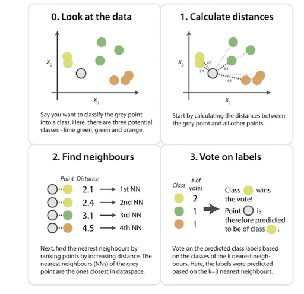

# **Exploring k-Nearest Neighbors in Recommendation Systems**

## **Introduction**

Today’s digital world is overflowing with information, making it nearly impossible for individuals to manually sift through the massive number of available options. As a result, recommender systems have become essential components of platforms such as Netflix, Amazon, Spotify, and TikTok. Their primary goal is to filter vast collections of items such as movies, products, songs, or videos, and present users with options they are most likely to enjoy. These systems work by analyzing users’ preferences, past behaviors, and item characteristics through interaction data such as impressions, clicks, ratings, likes, and purchases (@ghosh2024).

This paper focuses on the k-nearest neighbors (kNN) algorithm within the context of recommendation systems. Although kNN is one of the more straightforward algorithms in machine learning, it plays a foundational role in collaborative filtering methods. kNN identifies users or items that are most similar in behavior or preferences and bases predictions on these neighbors. Its simplicity and intuitive mechanics make it especially suitable for educational purposes and small scale recommendation tasks.

Before exploring the details of kNN, this paper outlines the broader landscape of recommendation systems to provide a foundation for understanding how kNN fits into the larger family of recommendation systems. The discussion then introduces and contrasts a different recommendation approach, Singular Value Decomposition (SVD) to highlight the strengths and weaknesses of kNN in practice.

Finally, the second half of the paper applies kNN to a real dataset to build and evaluate a simple interactive recommender system so as demonstrate how the method works in practice gauge its performance.

## **Overview of Recommender Systems**

Recommendation systems work by estimating how much a user is likely to enjoy an item they have not yet interacted with. They do this by analyzing **user behavior**, such as past ratings or interactions and **item features**, such as genre, creator, or textual descriptions. The goal is to estimate a preference score, ${r}_{u,i}$ which measures how likely user u is to enjoy item i. Recommendations are then generated by selecting the items with the highest scores. More details in section \ref{sec-rec} below.

To understand how k-nearest neighbors (kNN) fits into this broader landscape, we will discuss two major families of recommendation approaches: content-based approach and collaborative filtering (There are hybrid recommenders too).

### **Content-Based Filtering**

Content-based recommender systems generate suggestions by comparing the attributes of items a user previously liked to those of new items. These attributes might include genres, keywords, textual descriptions, or metadata. The item descriptions, which are labeled with ratings, are used as training data to create a user-specific classification or regression modeling problem. As Aggarwal explains, for each user the training documents correspond to the descriptions of the items she has bought or rated (@aggarwal2016,p. 14). For example, if a shopper frequently purchases skincare products, the system recommends related cosmetic items.

The underlying assumption is that user preferences are largely consistent, and similar items will yield similar satisfaction (@ghosh2024). These models rely heavily on item features, making them effective in domains where rich metadata is available.

### **Collaborative Filtering**

Collaborative filtering takes a different approach by focusing on patterns of behavior across users rather than item attributes. The key assumption is that users who behaved similarly in the past will behave similarly in the future. The main challenge in designing collaborative filtering methods is that the underlying ratings matrices are sparse (Most ratings are unspecified). However, in collaborative filtering methods, these unspecified ratings can be imputed because the observed ratings are often highly correlated across various users and items. There are two main subtypes:

#### **Memory-Based Methods**

Memory-based methods make predictions directly from observed ratings by identifying similarities among users or items. kNN is the most common example and can be further categorized into user-based kNN and item-based kNN as we'll see in the next sections. The advantages of memory-based techniques are that they are simple to implement and the resulting recommendations are often easy to explain. On the other hand, memory-based algorithms do not work very well with sparse ratings matrices (@aggarwal2016).

#### **Model-Based Methods**

Model-based approaches use machine learning techniques to uncover latent patterns in the rating matrix. Examples include Matrix factorization, SVD and Neural networka. They tend to outperform memory-based methods on large, sparse datasets but are less transparent to users and developers. Notably, many hybrid recommenders combine kNN with model-based techniques, such as SVD, to balance simplicity and predictive power (@hssina2021).

## K-Nearest Neighbors in Recommendation Systems

This section provides a deeper exposition of how kNN works, beginning with motivation and intuition, then moving into supervised-learning kNN, and finally examining how the algorithm is adapted for recommendation systems. A worked toy example concludes the section to illustrate the computations concretely.

### **Motivation:** Why Neighbors Matter in Recommendations

The appeal of neighborhood‑based methods lies in their simplicity as people with similar tastes tend to enjoy similar things. If two users have consistently rated the same movies in comparable ways, then the films one user has enjoyed but the other has not yet seen become strong candidates for recommendation. This intuition, that preferences cluster and can be shared across neighbors, forms the foundation of k‑Nearest Neighbors (kNN) in recommender systems. By exploiting these local patterns, kNN can generate useful predictions without the need for complex modeling (@nikolakopoulos2021).

### **How kNN Works in Supervised Learning**

Before adapting kNN to recommender systems, it helps to first understand how the algorithm works in its original setting. Unlike most algorithms we've seen in class that estimate parameters or fit equations, kNN is a “lazy learner” (from wikipedia-should i cite this or add to the integrity page). It stores the training data and defers computation until a query arrives. When a new example is presented, the algorithm measures its similarity to all stored examples, selects the *k* closest ones, and bases its prediction on their values.

In classification tasks, the new example is assigned to the majority class among its neighbors. In regression, the prediction is the average of their values. Weighted variants of kNN give greater influence to closer neighbors, which reduces the impact of outliers. The choice of *k* is critical to prevent over or under fitting. Too small a neighborhood makes the algorithm sensitive to noise, while too large a neighborhood can dilute meaningful signals.

{width="300px" height="300px"}

Because kNN does not assume any particular distribution of the data, it is considered non‑parametric. This flexibility makes it easy to apply, but it also introduces challenges in high‑dimensional spaces where distances lose contrast, a phenomenon known as the curse of dimensionality (@kramer2013, pg 19). (Still don't fully understand the phenomenon. will return to explain when I do)

### **How kNN Works in Recommender Systems** {#sec-rec}

In recommendation settings, the task is to predict missing entries in a sparse user–item matrix of size (number of users) × (number of items). Each row represents a user, each column an item, and most cells are empty because users interact with only a small fraction of available items. Below is an example of such matrix:

| User / Item | A   | B   | C   | D   |
|-------------|-----|-----|-----|-----|
| U1          | 4   | 4   | ?   | 3   |
| U2          | 4   | 5   | 2   | ?   |
| U3          | ?   | 4   | 4   | 3   |
| U4          | 2   | ?   | 5   | ?   |

Since most cells are empty, kNN adapts by computing similarities only on overlapping ratings. This reliance on shared ratings is both a strength because it uses actual behavioral similarity and a weakness because sparsity may cause the similarities to be unreliable (@kramer2013). Two main variants are used:

-   **User‑based kNN:** The system identifies the *k* users most similar to the target user and infers preferences from their ratings. For example, if User 1 and User 2 have rated many of the same items similarly, then User 2’s rating of a new item can help predict User 1’s interest.
-   **Item‑based kNN:** Instead of comparing users, the system finds items that consistently receive similar ratings across users. If Item A and Item B are rated alike by many users, then a user who liked Item A is predicted to enjoy Item B as well. Item‑based kNN is often more stable because item relationships remain consistent even as new users enter or leave the system. For this reason, modern commercial recommenders tend to use item-based kNN over user-based (@ricci2022).

Similarity metrics are central to these computations. **Cosine similarity** measures the angle between rating vectors, which makes it resistant to differences in rating scales. **Pearson correlation** adjusts for user biases by centering ratings around individual means. **Adjusted cosine similarity** , which is commonly used in item‑based kNN, subtracts user averages before computing similarity to reduce the effect of rating habits (@aggarwal2016). The similarity scores typically range from -1 to 1. With -1 for vectors that are polar opposites, 0 where there is no correlation and 1 for perfectly similar vectors. (Should I include the formulas for computing the 3 similarity metrics?)

Once similarities are computed, predictions are made using weighted averages. In user-based approach, a simple average of is often misleading because different users have different rating scales. One user might rate movies from 3 to 5 stars, while another uses the full 1-to-5 range. To account for this, we use the deviation from each user's average rating. For user‑based kNN, defines one formula for the predicted rating of user (u) for item (i) as:

$$
P_{u,i} = \bar{r}_u + \frac{\sum_{v \in N} sim(u,v) \cdot (r_{v,i} - \bar{r}_v)}{\sum_{v \in N} |sim(u,v)|}
$$

Where;

-   $P_{u,i}$ is the predicted rating for the target user (u) on item (i).

-   $\bar{r}_u$ is user (u)’s average rating. We add it at the end so that the prediction is returned to the user’s original rating scale.

-   N is the neighborhood of users most similar to (u) who have rated item (i).

-   $\text{sim}(u,v)$ is the similarity score between the target user (u) and a neighbor (v).

-   $r_{v,i} - \bar{r}_v$ is neighbor (v)’s rating of item (i), centered by subtracting their own average rating. This expresses how much higher or lower than average the neighbor rated that item.

-   The denominator, $\sum_{v \in N} |\text{sim}(u,v)|$, normalizes the weighted sum so that the prediction isn’t inflated by the number or magnitude of similarity scores.

For item-based collaborative filtering, the logic mirrors the user-based approach but is slightly simpler. To predict user (u)’s rating for item (i), we look at the other items that user (u) has already rated. The prediction is formed by taking a weighted average of those ratings, where the weights come from the similarity between item (i) and each neighboring item.

The formula is:

$$
P_{u,i} = \frac{\sum_{j \in N} sim(i,j) \cdot r_{u,j}}{\sum_{j \in N} |sim(i,j)|}
$$

Where;

-   $P_{u,i}$ is the predicted rating for user (u) on item (i).

-   N is the set of items most similar to item (i) that user (u) has already rated.

-   $\text{sim}(i,j)$ is the similarity between the target item (i) and a neighbor item (j).

-   $r_{u,j}$ is the rating user (u) gave to item (j).

One important detail is that we do not need to adjust for user averages here. Because all ratings involved in the calculation come from the same user, their rating scale is already consistent across items. As a result, the weighted average directly reflects how much the user liked similar items, making the item-based formulation slightly simpler than the user-based version.

Both formulas and breakdowns were derived from (@apxml2025).

#### **Toy Example**

We finish with a toy example adapted from Aggawral's book to emphasize idea. Consider a simple dataset of three users and three movies:

| User | A   | B   | C   |
|------|-----|-----|-----|
| U1   | 5   | 4   | ?   |
| U2   | 4   | 4   | 2   |
| U3   | 1   | 1   | 1   |

**Entries:** Ratings on a 1–5 scale. The “?” is the missing rating we want to predict (U1’s rating for Movie C).

First, we compute the similarity between Movie C and movies that U1 has already rated (A and B) using cosine similarity.

- **Movie A ratings vector:** [5, 4, 1] from U1, U2, U3  
- **Movie B ratings vector:** [4, 4, 1] from U1, U2, U3  
- **Movie C ratings vector:** [?, 2, 1] → U1’s rating is missing, so we only use U2 and U3: [2, 1]

Now, 

To compute **sim(A, C)**, we compare Movie A’s ratings from U2 and U3 ([4, 1]) with Movie C’s ratings from U2 and U3 ([2, 1]).

$$
sim(A,C) = \frac{(4 \cdot 2) + (1 \cdot 1)}{\sqrt{4^2+1^2} \cdot \sqrt{2^2+1^2}} \approx 0.98
$$

To compute **sim(B, C)**, we compare Movie B’s ratings from U2 and U3 ([4, 1]) with Movie C’s ratings from U2 and U3 ([2, 1]).

$$
sim(B,C) = \frac{(4 \cdot 2) + (1 \cdot 1)}{\sqrt{4^2+1^2} \cdot \sqrt{2^2+1^2}} \approx 0.96
$$

These values (0.98 and 0.96) show that Movies A and B are both highly similar to Movie C therefore we use their ratings to calculate the predicted rating for Movie C.

Plugging in values into the Item-Based formula we get:

$$
P_{U1,C} = \frac{(0.98 \cdot 5) + (0.96 \cdot 4)}{0.98 + 0.96} = \frac{4.9 + 3.84}{1.94} \approx 4.55
$$

U1’s predicted rating for Movie C is about 4.6 stars. The recommendation system system expects U1 to enjoy Movie C almost as much as Movies A and B.

### **Strengths and Weaknesses of kNN in Recommendation Systems**

As we established in the sections above, kNN requires no training phase, is easy to explain, and works well for small or dense datasets where overlaps are plentiful. Its neighbor‑driven reasoning makes it particularly suitable for educational settings and for systems where interpretability is valued.

However, kNN also has notable weaknesses. Its reliance on overlapping ratings makes it vulnerable to sparsity, and its computational cost grows quickly with dataset size. In high‑dimensional rating matrices, distance metrics can become unreliable therefore reducing accuracy. These limitations explain why kNN is often used as a baseline method, while large‑scale commercial systems rely on more advanced model‑based approaches such as matrix factorization or deep learning (@hssina2021).

## **Comparison to a Model-Based Method (SVD)**

While kNN provides an intuitive way to generate recommendations by looking at neighbors, it struggles with sparse data and scalability. To address these challenges, recommender systems often turn to **model-based methods**. One of the most influential is **Singular Value Decomposition (SVD)**, a matrix factorization technique that has become central to modern recommendation engines (Hssina et al. 2021; APXML 2025).

### What SVD Does (High-Level)  
SVD takes the large, sparse user–item ratings matrix \(R\) and decomposes it into three smaller matrices:

$$
R = U \cdot \Sigma \cdot V^T
$$

- **U:** Represents users in terms of hidden “taste dimensions” (latent factors).  
- **$Sigma$:** Diagonal matrix of singular values, showing which factors are most important.  
- **$V^T$:** Represents items in terms of the same latent factors.  

By keeping only the top k singular values, SVD compresses the ratings matrix into a lower-dimensional representation. This reveals hidden patterns of preference for example, one factor might capture a user’s tendency toward action/sci‑fi movies, while another captures romance/musicals. Predictions for missing ratings are made by combining a user’s latent profile with an item’s latent profile.

This approach differs fundamentally from kNN. While kNN Predictions rely on local neighborhoods and finds similar users or items directly from observed ratings, SVD learns a compressed representation of the entire dataset and its predictions come from latent factors rather than direct neighbors.  

kNN is transparent and easy to interpret (“your neighbor liked this, so you might too”), but it struggles with sparsity and scalability. SVD, by contrast, is less interpretable because latent factors are abstract, yet it generalizes better and scales efficiently to millions of users and items.

The trade-offs between the two methods can be summarized as follows:

| Aspect                  | kNN (Memory-Based)                          | SVD (Model-Based)                          |
|--------------------------|----------------------------------------------|--------------------------------------------|
| **Mechanism**            | Direct similarity between users/items        | Factorizes ratings matrix: $R = U \Sigma V^T$ |
| **Data requirement**     | Works directly on raw ratings                | Needs enough data to learn latent factors   |
| **Scalability**          | Struggles with millions of users/items       | Efficient at large scale once trained       |
| **Cold start problem**   | Severe (new users/items have no neighbors)   | Still an issue, but generalizes better      |
| **Accuracy**             | Good for small datasets, local patterns      | Better for large datasets, global patterns  |
| **Interpretability**     | Easy to explain (“neighbors liked it”)       | Harder to explain (latent factors abstract) |

For small educational datasets or applications where interpretability is paramount, kNN remains a useful choice. Its neighbor-driven reasoning makes it particularly suitable for teaching and for systems where transparency is valued. For commercial platforms like Netflix or Spotify, where accuracy and scalability matter most, SVD is the dominant approach. By compressing massive rating matrices into latent factors, SVD not only improves predictive accuracy but also makes large-scale recommendation feasible. In short, kNN thrives on simplicity and transparency, while SVD thrives on efficiency and predictive power, together illustrating the evolution of recommender systems from neighbor-driven reasoning to model-based learning.

## **Application: Building a Simple Recommendation Engine with kNN**

### **Dataset Description + Data Wrangling**

### **Implementing kNN + Model Evaluation**

### **Results + Interpretation**

## **Reflection (?)**

## **Conclusion**

## **Appendix**

## **References**
